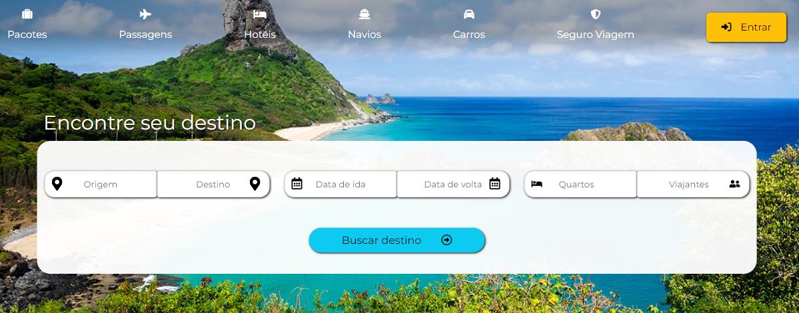
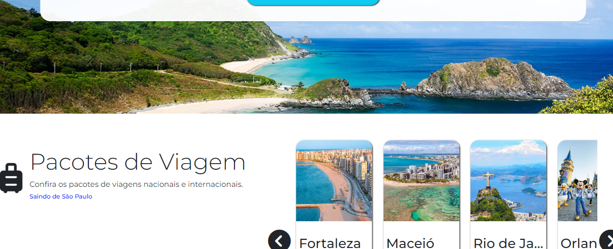

# Projeto de um site para uma agência de viagens
Estudo desenvolvido com HTML, CSS, SASS, JavaScript (jQuery) e Bootstrap
Também foram feitas práticas usando arquivo json e técnica Parallax na imagem da seção hero.

